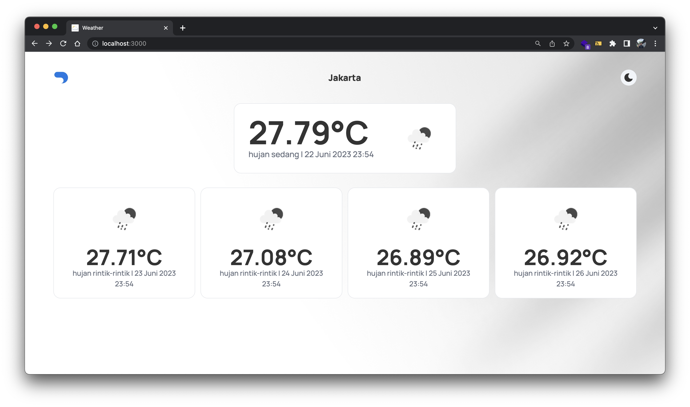

# Weather App

## Preview



## Getting Started

First, install dependencies:

```
npm install
```

Create env file `.env.locale`:

```bash
#API KEY FROM https://openweathermap.org
API_KEY=YOUR API KEY
#LATITUDE LOCATION JAKARTA
LAT=-6.1753942
#LONGITUDE LOCATION JAKARTA
LON=106.827183
#URL HISTORICAL WEATHER DATA
API_URL=https://api.openweathermap.org/data/3.0/onecall/timemachine
```

Now you can run the app by type one of the code below in terminal:

```bash
npm run dev
# or
yarn dev
# or
pnpm dev
```

Open [http://localhost:3000](http://localhost:3000) with your browser to see the result.

This project uses [`next/font`](https://nextjs.org/docs/basic-features/font-optimization) to automatically optimize and load Manrope, a custom Google Font.

## Demo website

see the demo website in [here](https://weather-app-deni.vercel.app/)
